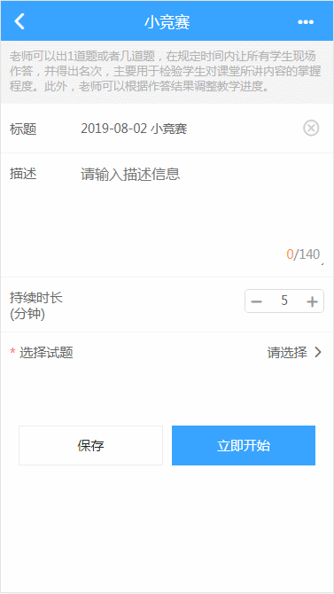
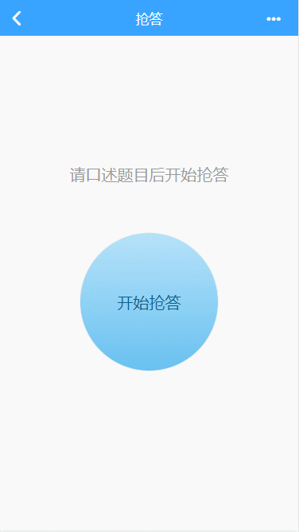
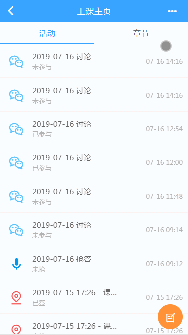

### 用户体验
- 操作成功的提示信息可以加感叹号，如**恭喜您，购买成功！**，操作失败的提示信息尽量不要加感叹号，以防给用户压迫感，可以使用**操作失败，请稍后重试。**等较为温和的提示信息。提示的位置也有讲究，如果提示完成后用户有大概率点击返回，那么就不应该在顶部提示（提示信息会遮住返回按钮，导致用户需要等待提示结束后才可以返回），而是在中部提示，其典型案例是操作成功的提示；如果用户不会在提示后返回，那么可以选择在顶部提示，好处是不会遮住页面的主要信息，典型案例是表单校验失败的提示，用户看到失败提示后有大概率不会点返回放弃操作，而往往选择继续操作，如果提示信息放在中部，将导致用户必须等待提示结束才可以继续操作，这是极不友好的。示例：



- 【推荐】除非必要，不要使用遮罩层锁屏或弹出内容打断用户操作，除了类似删除确认等情况外要做到尽可能少地打扰到用户。
**最佳实践：** 如何处理保存时的提示操作？ 推荐的做法是禁用按钮，在按钮上添加提示图标和信息，在请求结束后再将按钮复原到原有样式（而不是使用一个遮罩层遮罩全屏，让用户除了等待之外什么也干不了）。示例：



- 【强制】每一个保存操作（尤其是添加等非幂等性的操作）都需要控制按钮的点击，在用户第一次点击后需要锁住按钮使其不可以再次点击直到操作成功或失败，否则可能发生重复提交等问题。
**最佳实践：**在使用BUI时可以用BUI提供的bui.btn().submit()的方式进行锁定于解锁操作，如果自己实现需要在ajax请求前锁定按钮，在请求结束（不管成功或失败）后解除锁定。

- 【强制】每一个需要异步加载的内容都需要显示loading，如查看用户列表，在用户列表还没有渲染出来前应该保持loading，这在用户的网络状况较差的情况下是体验非常好的。如果是耗时操作（如耗时的统计）还可以设计一个带有进度的loading，进度是虚拟的，如果没有加载完，可以让其卡在90直到请求结束（这样做的原因是降低用户等待时的焦虑感）。


- 【强制】如果请求的内容为空需要在页面显示空列表提示，不能直接显示空白页面，这会使用户产生“页面是否加载完成了？”的疑惑。正确的做法是使用一个表意清楚的图标和一段温馨提示对此空白页面进行描述。示例页面：


- 【推荐】占位内容的重要性：前后端分离后，页面先展示，然后才是ajax异步加载数据，因此在数据渲染到页面的期间内，要尽量将即将到达页面的内容告知用户，例如帖子详情界面，我们可以将帖子的标题、作者、作者头像、发布时间、评论等信息提前使用占位内容占好位置（一般的实现是做出若干个灰色背景的块提前占位）。示例页面：



- 【推荐】操作提示的使用场景及规范
见[操作提示使用场景及规范](操作提示使用场景及规范.md)


### 命名规范
- 【强制】http接口必须以动名词的形式命名，如动词get+名词message，命名为getMessage，这样可以清晰地表明意图，由于大部分的接口是作CURD操作，所以推荐以create/save/update/delete/get/list开头。此外，接口的命名长度没有限制，只要能清晰表明意图都可以使用，短而优的命名固然好，但是有时候会丢失信息，如果有的接口具备一定的特殊性，应该把接口的意图完整描述出来，如listMessageInClass，从命名就可以推测出此接口的作用是获取班级下的消息列表。
正例：getMessage、listUser、deleteReply、updateUserInfo
反例：user、entityCreate、startHomework、toCreatePage

- 【强制】BUI的组件必须使用“ui”开头，如"uiDialog"、"uiUserList"，这样做的好处是我们可以快速区分页面表现数据与业务数据，如"userList"与"uiUserList"一看就知道userList是业务数据，uiUserList是用来展示业务数据的List组件。

- 【推荐】html模板的组装函数推荐使用”template“开头，如"templateUserList"一看就知道是生成用户列表的模板生成函数。

- 【推荐】如果使用了art-template等前端模板引擎，推荐使用“render“前缀的函数用于页面渲染，如：
```javascript
function renderUserList(){
    $('#uiUserList').html(template('userList.art', {
        userList: userList
    }));
}
```

- 【强制】BUI模块抛出的接口名称应清楚地描述其作用，如用户列表模块抛出**刷新用户列表**的接口名称为pageview.refreshUserList，而不要使用pageivew.back等无意义的名称。


### JS篇
- 【强制】无论在什么情况下都要注意undefined，规避undefined有很多方式，以下提供一种好用简单的方法：
```javascript
    // 参数arg需要传入字符串
    function func(arg){
        //
    }
    
    var val; // undefined
    func(val || ''); // 最终传入函数的参数为空字符串，而非undefined
```

- 【实践】js中undefined/null/""的区别：
undefined才是js真正处理为空的标准，null只是针对对象(Object)而言，如：
```javascript
function getObject(flag){
    if(flag){
        return {
            name: '二蛋',
            age: 12
        };
    }
    // 之所以返回null是因为此函数约定输出一个对象，如果为空，就应该输出对象的空值null而不是不输出，不输出就是undefined
    return null;
}
```
如果要判断一个字符串不为空，不懂这三者区别的童鞋可能会这样判断：
```javascript
if(str != undefined && str != null && str != ""){}
```
但是，实际上只要这样判断就可以了：
```javascript
if(str){}
```

- 【实践】js判空，以下演示两种经典的判空场景：
```javascript
    var str = '123';
    if(str){} // str != undefined && str不为空
    var arr = [];
    if(arr && arr.length){} // arr != undefined && 数组不为空
```
**js将undefined/null/空字符串/0转换为布尔值false**


### BUI篇
- 【强制】后台不允许传递诸如 `pages/page/module1/index.html` 这样的路由地址到前台，如果前台更改了此路由地址对应的文件名或路径将导致路由失败。
  *如果路由的地址在特定情况下会发生变化，则传递一个标志该变化的参数到前台，由前台决定路由到什么地址*

- 【强制】BUI的所有图标均以"icon-"开头，如果我们需要定义自己的图标，切勿以"icon-"开头，应当与BUI的图标区分开。
  正例：icons-home icons-user
  反例：icon-home icon-user

- 【强制】选取元素一律使用router.$('#id')的方式，不要使用$('#id')这种方式获取，router.$()方式能保证获取到的元素是该模块下的，而$()不能，在某些特殊情况下可能会获取到多个相同id的元素，因此，在不知道用什么方法时使用最稳妥的router.$()方法。

- 【推荐】使用BUI提供的布局框架，此布局框架基于流式布局与flex布局，可以完成绝大多数的布局场景。

- 【强制】表单校验失败时的提示一律使用hint组件，不要使用alert组件，对用户而言肯定不希望每次一点提交就弹出了令人反感的提示框，使用hint组件在上方弹出错误原因可以有效降低打扰率，提高用户的效率。
**最佳实践：**上述方式也不是最佳方案，因为表单的错误没有一次性暴露出来，最好的方法是在表单的控件周围显示错误信息以告知用户。

- 【强制】针对BUI的单页开发，无论在任何情况下都不要使用诸如`location.reload()`等方式刷新页面，单页开发的意义在于页面只会在初始化的时候发生一次同步请求，之后的所有页面都使用异步的方式渲染到客户端，如果使用同步刷新的方式就是违背了单页开发的本质。

- 【强制】非分页数据一律不允许使用List组件。List组件的最大特性就是支持下拉刷新和滚动加载，它的内部维护了分页相关的数据。如果请求的数据不支持分页，那就不应该使用List组件，如果页面需要下拉刷新，使用PullRefresh组件代替List组件。

- 【强制】最好使用jQuery与Zepto的公有api，这样的好处是可以根据需要切换BUI的基础依赖js，BUI默认依赖了Zepto，但是可能被替换为jQuery（典型情况就是项目中引入了依赖于jQuery的js库），如果项目中使用了Zepto的独有api（如Touch组件）将导致项目运行报错，此时要将所有Zepto的独有api调用删除这是很困难的。反之亦如是，如果调用了jQuery的独有api，这样将项目中的Zepto替换为jQuery时也会导致项目运行报错，虽然这种情况较为少见（Zepto替换为jQuery可以理解为一次Zepto的升级，因为jQuery >= Zepto，反之将jQuery降级的情况也就少见了），但是为了防止这类问题，最好的办法就是使用jQuery与Zepto的api的交集，这样不管作升级还是降级处理，项目都可以很好地完成适配。
**注：**jQuery与Zepto的一些区别：jQuery提供伪类选择器，Zepto没有；jQuery的data()支持对象存储，Zepto不支持；Zepto提供了tap/doubletap等移动端的事件，jQuery没有（这就是为什么项目中有双击的需求，我们都不使用Zepto而转而使用touch.js的原因了）。具体所有的区别需要阅读jQuery与Zepto的官方文档进行对比。


### art-template篇
- 【重要】id重复问题：
template()函数的第一个参数为容器的id，这个id在全局必须是唯一的，否则只会取所有元素的第一个（原理：temlate()函数的内部会使用document.getElementById()的方式获取DOM，如果id重复，则获取第一个）。
**最佳实践：**为了杜绝脚本标签id重复的问题（尤其在单页应用中此问题更严重），最好使用一个不可能重复的字符串作为其id（例如UUID、GUID等）。

- 【重要】模板判空问题：
模板最终会被解析为JavaScript语句执行，所以其判空与js的判空一样重要，如果对一个undefined的变量调用函数，就会导致模板无法渲染。


### Java后端
> Java后端的开发规范以《阿里巴巴Java开发手册》为基准，在此基准下我们补充了一些规范。

